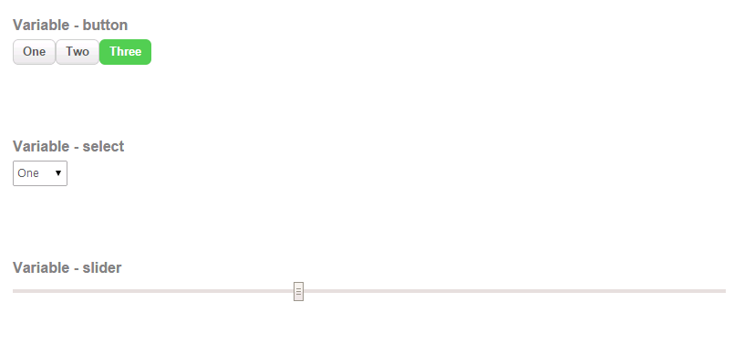
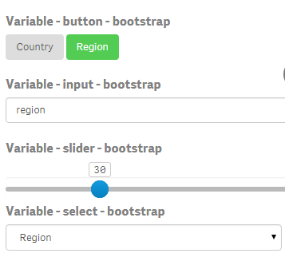
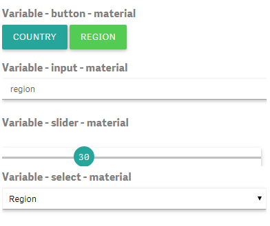

# qsVariable
Variable extension for Qlik Sense

## This repository is now archived
The extension is, under the name qlik-variable, now available in the Dashboard bundle, available with the Qlik Sense installation.
To install it simply select the Dashboard bundle in the installation progam. 

The current source code is available at:
https://github.com/qlik-oss/qsVariable/tree/qlik-variable

It is also supported by Qlik, so for bugs and suggestions you should contact Qlik.

## Features
Allows the user to set the value of a variable.
Four different ways to render:
- Buttons: one button for each defined value
- Select: HTML select containing all defined values
- Field: an input field, no validation, anything can be entered
- Slider: a HTML slider, you can define min (default 0), max (default 100) and step (default 1)

You can have an expression to define the available values in a dropdown or buttons. 

## News in version 5.2
The property 'Thin Header' will make sure that if you do not have a title or subtitle the header will be very thin,
to avoid buttons getting cut off.

## News in version 5.0
Build process has been modified so that the css style sheet is now included in the packaged js file. No separate loading of css file any more.

The extension yet again uses Capbilities API/qlik.js.

### Qlik Versions
The extension has been tested with the following versions:
November 2017 patch 1
September 2017 patch 2
June 2017 patch 3
3.2 SR5 

If you are using version 3.2, there is a bug in the capabilities API in this version which means that the extension might not work in a mashup with more than one app. If you encounter this bug, please upgrade to a leter release.

Three different styles to choose from:
## Qlik
Styled like toolbar and property panel in Qlik Sense

## Bootstrap
Styling inspired by Twitter Bootstrap

## Material
Styling inspired by Google Material design

## Vertical slider
You can now also have vertical orientation for your slider

## Installation
Download distribution zip file from here: https://github.com/erikwett/qsVariable/raw/master/dist/variable.zip

Qlik Sense Desktop: unzip to a directory under [My Documents]/Qlik/Sense/Extensions, for example variable.

Qlik Sense server: import the zip file in the QMC.
